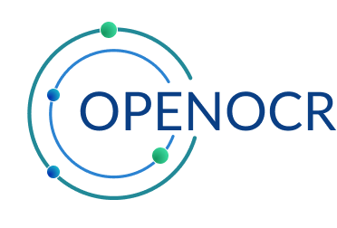

<h1 align="center">
  <br>
 
  <br>
  OpenOCR
  <br>
</h1>

<h4 align="center">A free OCR tool.</h4>

<p align="center">
 
 
 
 
 
</p>

## Key Features

* Extract text from images
* Supports a variety of image formats
* Easy to use
* Open source

## How To Use

To clone and run this application, you'll need [Git](https://git-scm.com) and [Node.js](https://nodejs.org/en/download/) (which comes with [npm](http://npmjs.com)) installed on your computer. From your command line:

```bash
# Clone this repository
$ git clone https://github.com/Banitongwa7/OpenOCR.git

# Go into the repository
$ cd OpenOCR

> NextJS

# Go into the directory
$ cd next_app

# Install dependencies
$ npm install

# Run the app
$ npm run dev # The app will then be available at http://localhost:3000

> NodeJS

# Go into the directory
$ cd server_api

# Install dependencies
$ npm install

# Run the app
$ npm start
```

> **Note**
> If you're using Linux Bash for Windows, [see this guide](https://www.howtogeek.com/261575/how-to-run-graphical-linux-desktop-applications-from-windows-10s-bash-shell/) or use `node` from the command prompt.

## Contributing

Contributions are welcome! To contribute, fork the repository and make your changes. Then, open a pull request.

## License

MIT
